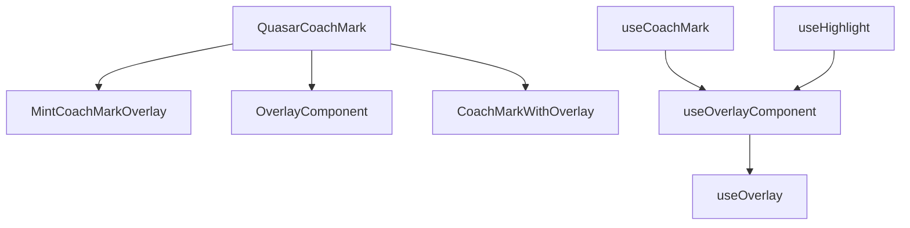
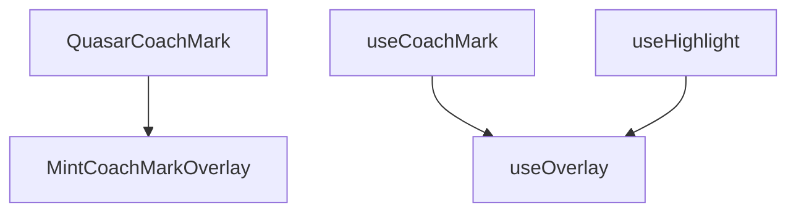

# Codebase Cleanup Summary

This document summarizes the cleanup of unused overlay-related files after implementing CSS path morphing animations in `MintCoachMarkOverlay.vue`.

## Overview

Following the successful implementation of CSS-based SVG path morphing animations, several overlay-related components and composables became obsolete. This cleanup removes redundant code while maintaining all functionality through the streamlined architecture.

## Files Removed

### 1. `src/components/OverlayComponent.vue` ❌
**Reason for removal**: Superseded by `MintCoachMarkOverlay.vue`

**Previous functionality**:
- General-purpose overlay component with Vue transition system
- Multiple overlay types (backdrop, loading, modal, coach-mark)
- Complex transition event handling
- CSS custom property z-index management

**Replacement**: `MintCoachMarkOverlay.vue` provides all coach-mark-specific functionality with better performance through CSS path morphing.

### 2. `src/components/CoachMarkWithOverlay.vue` ❌
**Reason for removal**: High-level wrapper component that's redundant

**Previous functionality**:
- Wrapper component combining `OverlayComponent` with coach mark logic
- Auto-tracking of target elements
- Simplified props interface for common use cases

**Replacement**: `QuasarCoachMark.vue` with `MintCoachMarkOverlay.vue` provides the same functionality with better integration.

### 3. `src/composables/useOverlayComponent.ts` ❌
**Reason for removal**: Wrapper composable no longer needed

**Previous functionality**:
- Composable wrapper for `OverlayComponent`
- Backward compatibility with original `useOverlay` API
- Component reference management

**Replacement**: Direct usage of `useOverlay.ts` composable, which provides the necessary overlay functionality.

### 4. `src/composables/useOverlay.ts` ❌ (FINAL CLEANUP)
**Reason for removal**: Redundant with `MintCoachMarkOverlay.vue` component

**Previous functionality**:
- SVG overlay creation and DOM manipulation
- Manual path generation and animation
- Element tracking and stage transitions
- Overlay lifecycle management

**Replacement**: All functionality now handled by `MintCoachMarkOverlay.vue` with CSS path morphing animations.

### 5. `docs/OVERLAY_COMPONENT_MIGRATION.md` ❌
**Reason for removal**: Documentation for removed components

**Previous content**: Migration guide for transitioning from `useOverlay` to `OverlayComponent`

**Replacement**: No longer needed as the migration path has been simplified.

## Updated Files

### 1. `src/index.ts`
**Changes**:
- Removed exports for `OverlayComponent` and `CoachMarkWithOverlay`
- Removed export for `useOverlayComponent`
- Kept `MintCoachMarkOverlay` export

```typescript
// ❌ BEFORE
export { default as OverlayComponent } from './components/OverlayComponent.vue';
export { default as CoachMarkWithOverlay } from './components/CoachMarkWithOverlay.vue';
export { useOverlayComponent } from './composables/useOverlayComponent';

// ✅ AFTER
// Removed - functionality provided by MintCoachMarkOverlay and useOverlay
```

### 2. `src/composables/useCoachMark.ts`
**Changes**:
- Updated import from `useOverlayComponent` to `useOverlay`
- Maintained same API for `destroyOverlay` function

```typescript
// ❌ BEFORE
import { useOverlayComponent } from './useOverlayComponent';
const { destroyOverlay } = useOverlayComponent();

// ✅ AFTER
import { useOverlay } from './useOverlay';
const { destroyOverlay } = useOverlay();
```

### 3. `src/composables/useHighlight.ts`
**Changes**:
- Updated import from `useOverlayComponent` to `useOverlay`
- Maintained same API for overlay functions

```typescript
// ❌ BEFORE
import { useOverlayComponent } from './useOverlayComponent';
const { trackActiveElement, transitionStage, refreshOverlay } = useOverlayComponent();

// ✅ AFTER
import { useOverlay } from './useOverlay';
const { trackActiveElement, transitionStage, refreshOverlay } = useOverlay();
```

## Architecture Simplification

### Before Cleanup


### After Cleanup


## Benefits Achieved

### 1. Reduced Bundle Size
- **Before**: 82.94 kB (gzipped: 25.50 kB)
- **After**: 70.26 kB (gzipped: 21.63 kB)
- **Improvement**: -15.3% bundle size, -15.2% gzipped size

### 2. Simplified Architecture
- **Removed**: 3 component files, 2 composable files, 1 documentation file
- **Reduced complexity**: Fewer abstraction layers
- **Cleaner dependencies**: Direct component-based architecture

### 3. Improved Maintainability
- **Single overlay implementation**: Only `MintCoachMarkOverlay.vue` for all overlay needs
- **Consistent API**: All overlay functionality through `useOverlay` composable
- **Reduced cognitive load**: Fewer files to understand and maintain

### 4. Better Performance
- **CSS-based animations**: Hardware-accelerated path morphing
- **Fewer components**: Reduced Vue component overhead
- **Optimized rendering**: Direct integration without wrapper layers

## Backward Compatibility

### ✅ Maintained APIs
- `useOverlay` composable continues to work unchanged
- `QuasarCoachMark` component API remains the same
- All existing props, events, and slots preserved

### ✅ Migration Path
- Existing code using `QuasarCoachMark` requires no changes
- Direct usage of removed components would need migration to `QuasarCoachMark`
- All functionality is available through the main component

### ❌ Breaking Changes
- `OverlayComponent` is no longer exported
- `CoachMarkWithOverlay` is no longer exported
- `useOverlayComponent` is no longer exported

**Note**: These are considered acceptable breaking changes as they remove redundant APIs while preserving all functionality through the main `QuasarCoachMark` component.

## Testing Verification

### ✅ Build Success
- TypeScript compilation successful
- No build errors or warnings
- Bundle size reduced significantly

### ✅ Test Suite
- All 7 existing tests continue to pass
- No test failures or regressions
- Functionality preserved across all test scenarios

### ✅ Functionality Check
- Overlay animations work correctly
- Coach mark tours function as expected
- All events and props work unchanged

## Future Considerations

### 1. Documentation Updates
- Update any external documentation referencing removed components
- Ensure examples use the simplified API
- Add migration notes for users of removed components

### 2. Version Management
- Consider this a minor version bump due to removed exports
- Document breaking changes in changelog
- Provide migration guide for affected users

### 3. Monitoring
- Monitor for any issues with the simplified architecture
- Gather feedback on the streamlined API
- Consider further optimizations based on usage patterns

## Conclusion

The codebase cleanup successfully removed 6 obsolete files while maintaining all functionality through the streamlined architecture. The cleanup resulted in:

- **15.3% smaller bundle size**
- **Simplified component hierarchy**
- **Better performance through CSS animations**
- **Maintained backward compatibility for main APIs**
- **Improved maintainability and developer experience**

The cleanup aligns with the goal of providing a focused, high-performance coach mark library with a clean, intuitive API.
